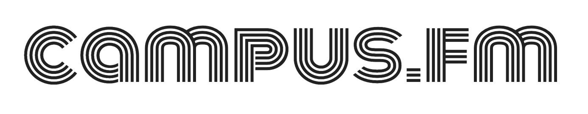
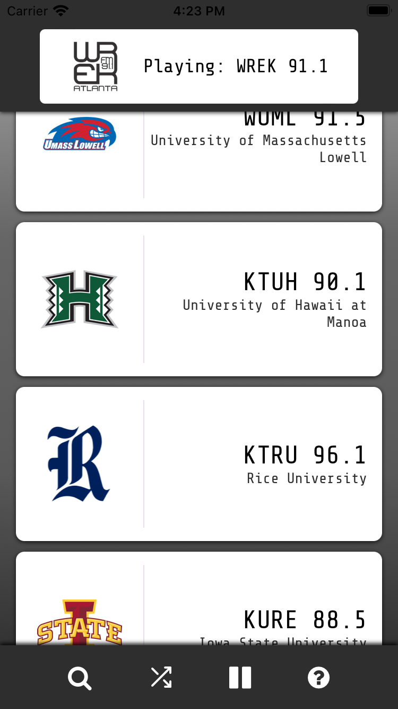

[![Contributors][contributors-shield]][contributors-url]
[![Forks][forks-shield]][forks-url]
[![Stargazers][stars-shield]][stars-url]
[![Issues][issues-shield]][issues-url]

<!-- PROJECT LOGO -->
 

    <h1>Campus FM Native</h1>
    
  

     
        <a href="https://github.com/xehl/cfm-native/"><strong>Explore the repo</strong></a>
     
  

## About The Project

Campus FM Native is a mobile-native (iOS and Android) implementation of [Campus FM](https://www.campus-fm.com/), a college radio streaming web app built by [@xehl](https://github.com/xehl/). This project was built in React Native using Expo and [React Native Track Player](https://github.com/doublesymmetry/react-native-track-player).

## Built With

- [![Javascript][javascript]][javascript-url]
- [![reactnative]][react-native-url]
- [![Expo]][expo-url]

  <h2>iOS Screenshot</h2>
  

<!-- MARKDOWN LINKS & IMAGES -->
<!-- https://www.markdownguide.org/basic-syntax/#reference-style-links -->

[contributors-shield]: https://img.shields.io/github/contributors/xehl/cfm-native.svg?style=for-the-badge
[contributors-url]: https://github.com/xehl/cfm-native/graphs/contributors
[forks-shield]: https://img.shields.io/github/forks/xehl/cfm-native.svg?style=for-the-badge
[forks-url]: https://github.com/xehl/cfm-native/network/members
[stars-shield]: https://img.shields.io/github/stars/xehl/cfm-native.svg?style=for-the-badge
[stars-url]: https://github.com/xehl/cfm-native/stargazers
[issues-shield]: https://img.shields.io/github/issues/xehl/cfm-native.svg?style=for-the-badge
[issues-url]: https://github.com/xehl/cfm-native/issues
[desktop-screenshot]: screengrabs/cfm-v1.5.png
[desktop-s-screenshot]: screengrabs/cfm-v1.5-select.png
[mobile-screenshot]: screengrabs/mobile-v1.5.png
[mobile-s-screenshot]: screengrabs/mobile-v1.5-select.png
[material-ui]: https://res.cloudinary.com/practicaldev/image/fetch/s--yayk2pWn--/c_limit%2Cf_auto%2Cfl_progressive%2Cq_auto%2Cw_880/https://img.shields.io/badge/Material--UI-0081CB%3Fstyle%3Dfor-the-badge%26logo%3Dmaterial-ui%26logoColor%3Dwhite
[material-ui-url]: https://mui.com/
[reactnative]: https://img.shields.io/badge/react_native-%2320232a.svg?style=for-the-badge&logo=react&logoColor=%2361DAFB
[react-native-url]: https://reactnative.dev/
[javascript]: https://img.shields.io/badge/JavaScript-F7DF1E?style=for-the-badge&logo=javascript&logoColor=black
[javascript-url]: https://www.javascript.com/
[node.js]: https://img.shields.io/badge/Node.js-43853D?style=for-the-badge&logo=node.js&logoColor=white
[node-url]: https://nodejs.org/en/
[expo]: https://img.shields.io/badge/expo-1C1E24?style=for-the-badge&logo=expo&logoColor=#D04A37
[expo-url]: https://expo.dev/
